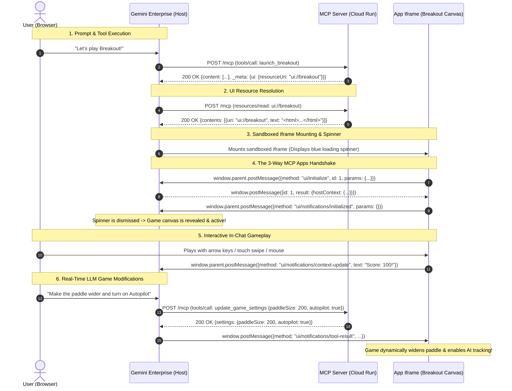

# Retro Breakout - Interactive MCP App for Gemini Enterprise

An interactive, retro Atari-style Breakout arcade game built as a **Model Context Protocol (MCP) App** (UI Extension) designed to run natively inside the **Gemini Enterprise Agent Platform (GEAP) / Discovery Engine**.

When a user in Gemini Enterprise prompts:
> *"Let's play a game"* or *"Launch Breakout"*

Gemini calls the MCP server's `launch_breakout` tool. The tool response references an interactive UI resource (`ui://breakout`), prompting Gemini Enterprise to fetch the HTML5 bundle and render the interactive canvas game directly inside the conversation thread. The user and the agent can then interact with the game in real-time, live-adjusting gameplay physics (paddle width, ball speed, lives) or activating cheat codes via natural language.

This project implements the official [Model Context Protocol Apps Specification](https://github.com/modelcontextprotocol/ext-apps).

---

## 🕹️ End-to-End Architecture & Lifecycle

```
┌─────────────────────────────────────────────────────────────────────────────────────────────┐
│                                 Gemini Enterprise (Chat UI)                                 │
│                                                                                             │
│  1. User Prompt: "Let's play a game of Breakout!"                                           │
│  2. Gemini Agent resolves intent -> calls MCP tool: launch_breakout                         │
│                                                                                             │
│  ┌───────────────────────────────────────────────────────────────────────────────────────┐  │
│  │ 🎮 [Sandboxed Iframe Container: ui://breakout]                                        │  │
│  │                                                                                       │  │
│  │   [Handshake] App (ui/initialize) ──► Host Context ──► App (ui/notifications/init)    │  │
│  │   [Status] Host dismisses loading spinner -> Interactive Canvas Renders at 60 FPS     │  │
│  │                                                                                       │  │
│  │   • Live Retro Canvas • Scanline Filters • Particle FX • AI Autopilot Tracker         │  │
│  │                                                                                       │  │
│  │   [Events -> Gemini] Score milestones, life lost, level cleared                       │  │
│  │   [Gemini -> App] Live paddle resize, ball speed, god mode overrides                  │  │
│  └───────────────────────────────────────────────────────────────────────────────────────┘  │
└──────────────────────────────────────────────┬──────────────────────────────────────────────┘
                                               │
                                               │ JSON-RPC 2.0 / MCP Protocol
                                               ▼
┌─────────────────────────────────────────────────────────────────────────────────────────────┐
│                                MCP Server (Cloud Run / Node.js)                             │
│                                                                                             │
│  • Tools:                                                                                   │
│    - launch_breakout: Returns text confirmation + _meta.ui.resourceUri ("ui://breakout")    │
│    - update_game_settings: Adjusts paddle width, ball speed, lives, autopilot, god mode     │
│    - trigger_game_cheat: Activates laser paddle, extra ball, slow ball, level bypass        │
│                                                                                             │
│  • Resources:                                                                               │
│    - ui://breakout (text/html;profile=mcp-app): Pre-cached, zero-dependency game bundle     │
│                                                                                             │
│  • Endpoints:                                                                               │
│    - POST /mcp: High-performance stateless JSON-RPC dispatcher for Gemini Enterprise        │
│    - GET /mcp & POST /mcp/messages: Server-Sent Events (SSE) streaming with keep-alive      │
│    - GET /authorize & POST /token: OAuth 2.0 endpoints for connector authentication         │
│    - GET /game: Direct standalone browser preview                                           │
└─────────────────────────────────────────────────────────────────────────────────────────────┘
```

---

## 🔄 Detailed Request, Handshake & Rendering Flow

The following sequence illustrates the complete lifecycle from connector setup to in-chat gameplay:



---

## 🤝 The MCP Apps 3-Way Handshake Protocol

When Gemini Enterprise encounters a tool response with `_meta.ui.resourceUri`, it renders a sandboxed `iframe` and presents a loading indicator to the user until the iframe confirms it is ready:

1. **`ui/initialize` (Request from Iframe to Host):**
   The application iframe immediately announces itself upon loading:
   ```json
   {
     "jsonrpc": "2.0",
     "id": 1,
     "method": "ui/initialize",
     "params": {
       "protocolVersion": "2024-11-05",
       "appInfo": {
         "name": "retro-breakout",
         "version": "1.1.0"
       },
       "appCapabilities": {
         "availableDisplayModes": ["inline", "fullscreen"]
       }
     }
   }
   ```

2. **Host Response (Host to Iframe):**
   Gemini Enterprise returns its host context and capabilities:
   ```json
   {
     "jsonrpc": "2.0",
     "id": 1,
     "result": {
       "protocolVersion": "2024-11-05",
       "hostCapabilities": {},
       "hostContext": { "theme": "dark" }
     }
   }
   ```

3. **`ui/notifications/initialized` (Notification from Iframe to Host):**
   Upon receiving the host's response (or via eager DOM load fallback), the iframe sends:
   ```json
   {
     "jsonrpc": "2.0",
     "method": "ui/notifications/initialized",
     "params": {}
   }
   ```
   **Crucial Step:** Receipt of `ui/notifications/initialized` signals the host to **dismiss the loading spinner** and make the interactive application visible.

---

## ⚡ Performance & Security Architecture

To guarantee smooth 60 FPS performance and 100% compatibility with Gemini Enterprise's strict iframe sandbox:

| Technique | Problem Solved | Implementation Detail |
| :--- | :--- | :--- |
| **Zero-Dependency Inlined Bridge** | Avoids CSP/CORS blocks on external CDN imports (`esm.sh`). | Standalone, spec-compliant `postMessage` RPC bridge inlined directly in `index.html`. |
| **Non-Blocking Initialization** | Prevents top-level `await` from freezing the canvas loop if host handshake lags. | Canvas and game loop start rendering immediately (<16ms) in parallel with handshake. |
| **In-Memory Asset Caching** | Eliminates synchronous disk I/O on every tool/resource read. | `src/index.ts` pre-reads and caches `index.html` at startup (`cachedGameHtml`). |
| **Particle Object Pooling** | Eliminates Garbage Collection (GC) thrashing and frame drops on brick explosions. | Pre-allocated 250-particle pool reusing objects without `new` or `splice`. |
| **Batched Canvas Draw Calls** | Reduces 2D context CPU state churn. | Avoids per-particle `ctx.save()` / `ctx.restore()`; batches draw operations by alpha/color. |
| **Delta-Time Physics Engine** | Prevents games from running 2x-4x too fast on 120Hz/240Hz monitors. | Uses `performance.now()` delta-time scaling for frame-rate-independent physics. |
| **SSE Keep-Alive Pings** | Prevents Cloud Run and reverse proxy timeout disconnections. | Emits periodic `: keep-alive\n\n` comments every 25 seconds. |

---

## 🛠️ MCP Tools & Resource Specification

### Resources
| URI | MIME Type | Description |
| :--- | :--- | :--- |
| `ui://breakout` | `text/html;profile=mcp-app` | Serves the complete self-contained Breakout UI bundle. |

### Tools
| Tool Name | Description | Key Parameters |
| :--- | :--- | :--- |
| `launch_breakout` | Launches the Breakout game iframe in chat. | *(none)* |
| `update_game_settings` | Live-adjusts physics parameters. | `paddleSize` (px), `ballSpeed`, `lives`, `autopilot` (bool), `godMode` (bool) |
| `modify_breakout_settings` | Flexible alias for adjusting game settings. | `paddleWidth`, `paddleSize`, `ballSpeed`, `lives`, `autopilot`, `godMode` |
| `trigger_game_cheat` | Applies arcade cheat codes. | `cheat` (`"god_mode"`, `"extra_ball"`, `"slow_ball"`, `"laser_paddle"`, `"win_level"`) |
| `apply_breakout_cheat` | Alias supporting camelCase and snake_case cheat names. | `cheatType`, `cheat` |
| `get_game_config` | Syncs initial/default configuration for UI. | *(none)* |
| `get_breakout_settings` | Returns active game session state. | *(none)* |

---

## ☁️ Deployment Guide (Google Cloud Run & Gemini Enterprise)

### 1. Deploy to Google Cloud Run
Deploy the application directly to Cloud Run in your GCP project:

```bash
gcloud run deploy mcp-breakout-arcade \
  --source . \
  --platform managed \
  --region us-central1 \
  --project <YOUR_GCP_PROJECT_ID> \
  --allow-unauthenticated \
  --port 8080
```

Note the generated service URL (e.g. `https://mcp-breakout-arcade-xxxxx.us-central1.run.app`).

### 2. Grant Discovery Engine Invoker Access (Private Deployments)
If deploying privately without `--allow-unauthenticated`, grant the Discovery Engine Service Agent permission to invoke your service:

```bash
gcloud run services add-iam-policy-binding mcp-breakout-arcade \
  --member="serviceAccount:service-<PROJECT_NUMBER>@gcp-sa-discoveryengine.iam.gserviceaccount.com" \
  --role="roles/run.invoker" \
  --region=us-central1
```

### 3. Register Custom MCP Server in Gemini Enterprise Console
1. In the Google Cloud Console, navigate to **Agent Builder (Discovery Engine) > Data Stores**.
2. Click **Create Data Store** and select **Custom MCP Server**.
3. Fill in the connection settings:
   - **MCP Server URL:** `https://<YOUR_CLOUD_RUN_URL>/mcp`
   - **Authorization URL:** `https://<YOUR_CLOUD_RUN_URL>/authorize` (or `https://accounts.google.com/o/oauth2/auth`)
   - **Token URL:** `https://<YOUR_CLOUD_RUN_URL>/token` (or `https://oauth2.googleapis.com/token`)
   - **Client ID & Secret:** Placeholder or OAuth Client credentials
   - **Enable PKCE Support:** Enabled
4. Save and activate the Data Store.
5. In the **Actions** tab, click **Reload custom actions** and enable the tools (`launch_breakout`, `update_game_settings`, etc.).

---

## 💻 Local Development

### Prerequisites
- Node.js 20+
- npm

### Installation & Run
```bash
# Install dependencies
npm install

# Start development server with auto-reload
npm run dev

# Or build and start production server
npm run build
npm start
```

* **Local MCP SSE Endpoint:** `http://localhost:8080/mcp`
* **Local Direct Game Preview:** `http://localhost:8080/game`

---

## 📄 License
Apache 2.0
