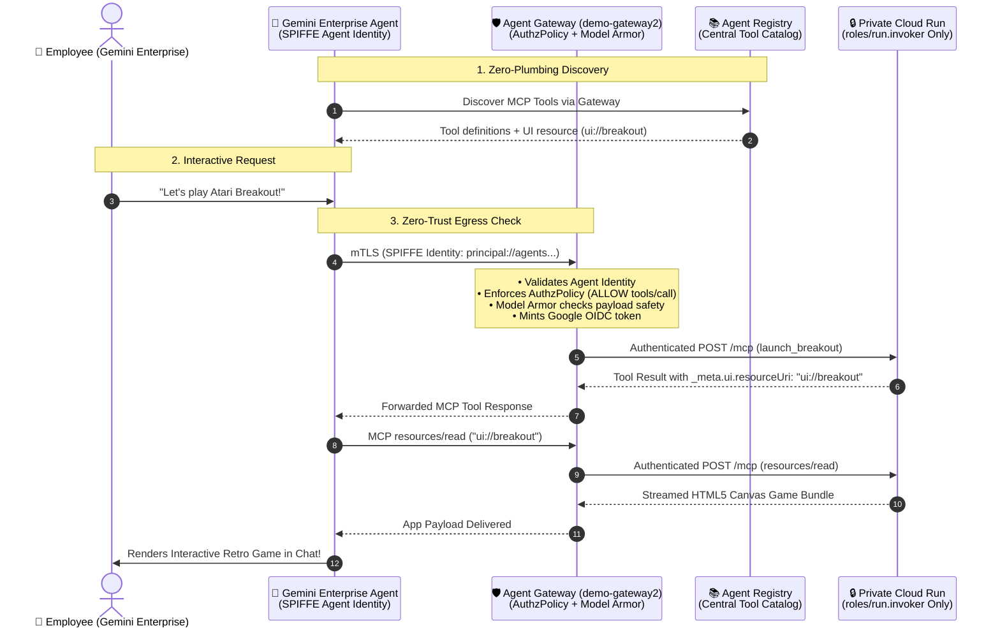
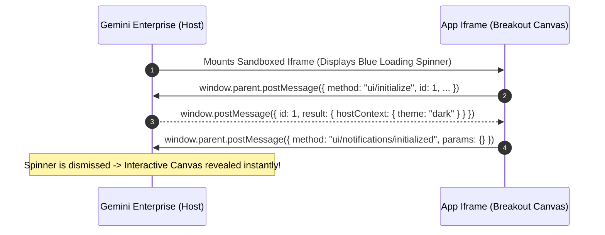

# 🕹️ Retro Breakout - Secure Enterprise MCP App for Gemini Enterprise

An interactive, retro Atari-style Breakout arcade game built as a **Model Context Protocol (MCP) App** (UI Extension) designed to run natively and securely inside the **Gemini Enterprise Agent Platform (GEAP) / Discovery Engine**.

When a user in Gemini Enterprise asks:
> *"Let's play a game"* or *"Launch Breakout"*

Gemini calls the MCP server's `launch_breakout` tool. The tool response references an interactive UI resource (`ui://breakout`), prompting Gemini Enterprise to fetch the HTML5 bundle over the authenticated MCP protocol and render the interactive canvas game directly inside the conversation thread.

The user and the agent can interact with the game in real-time, live-adjusting gameplay physics (paddle width, ball speed, lives) or activating cheat codes (like **Twin Laser Cannons**, **Mega Paddle**, and **God Mode**) via natural language or an in-app settings HUD.

This project implements the official [Model Context Protocol Apps Specification](https://github.com/modelcontextprotocol/ext-apps) within Google Cloud's zero-trust enterprise security architecture.

---

## 🏛️ Enterprise Architecture: The 4 Pillars of Governed MCP Apps



### 1. Centralized Catalog via Agent Registry
Eliminates hardcoded webhooks and manual connector sprawl. Services are registered centrally with their schemas, interfaces, and `_meta.ui` tags so Gemini Enterprise discovers tools automatically behind **Agent Gateway**.

### 2. Zero-Trust Ingress via Agent Identity & Private Cloud Run
The backend Cloud Run service runs with `--no-allow-unauthenticated` (public internet access disabled). It strictly accepts incoming requests with verified Google Cloud OIDC tokens from authorized Service Agents:
- **Discovery Engine Service Agent** (`service-<PROJECT_NUMBER>@gcp-sa-discoveryengine.iam.gserviceaccount.com`)
- **Agent Gateway Service Agent** (`service-<PROJECT_NUMBER>@gcp-sa-agentgateway.iam.gserviceaccount.com`)
- **Service Extensions Data Plane Agent** (`service-<PROJECT_NUMBER>@gcp-sa-dep.iam.gserviceaccount.com`)

### 3. Egress Governance via Agent Gateway & Model Armor
Outbound tool calls flow through **Agent Gateway** (`demo-gateway2`):
- **`REQUEST_AUTHZ` (Identity & Protocol Gate):** Verifies the agent's cryptographic SPIFFE identity (`principal://agents.global...`) over mTLS and evaluates granular tool permissions.
- **`CONTENT_AUTHZ` (Deep Payload Inspection & Model Armor):** Sanitizes tool arguments in flight, blocking prompt injections, jailbreak attempts, or malicious parameter tampering before requests hit the backend.

### 4. Zero-CDN Delivery via MCP Apps Protocol
In standard web development, applications load assets from external CDNs, creating CORS and Content Security Policy (CSP) vulnerabilities. In MCP Apps, the entire HTML/JS canvas bundle is delivered directly through the authenticated MCP connection (`resources/read: ui://breakout`) and safely mounted inside an isolated iframe.

---

## 🎮 Gameplay, Weapons & Interactive Capabilities

| Feature | Description | Controls |
| :--- | :--- | :--- |
| **`⚡ Laser Cannons`** (`laser_paddle`) | Equips the paddle with twin blaster turrets; fires laser bolts upward that disintegrate bricks. | **`SPACE`**, **`F`**, or **Canvas Click/Tap** |
| **`📏 Mega Paddle`** (`mega_paddle`) | Expands paddle width to 220px for easier ball defense. | Natural language or Settings Drawer |
| **`🛡️ God Mode`** (`god_mode`) | Turns paddle cyan and bounces the ball safely off the bottom floor. | Natural language or Settings Drawer |
| **`🤖 AI Autopilot`** (`autopilot`) | Uses an onboard tracking algorithm to align the paddle to the ball trajectory automatically. | Natural language or Settings Drawer |
| **`🔄 Level Progression & State Persistence`** | Score, lives, active weapons (Laser Cannons), and physics settings seamlessly persist across levels and chat turns via `sessionStorage`. | Handled automatically |
| **`⚙️ Settings HUD Drawer`** | Unobtrusive settings menu positioned in the bottom-right corner bezel so it never overlaps the scoreboard. | Press **`[ESC]`** or click **`⚙️ SETTINGS`** |

---

## 🤝 The MCP Apps 3-Way Handshake Protocol

When Gemini Enterprise encounters a tool response with `_meta.ui.resourceUri`, it renders a sandboxed `iframe` and presents a loading indicator to the user until the iframe confirms it is ready:



---

## 🛠️ MCP Tools & Resource Specification

### Resources
| URI | MIME Type | Description |
| :--- | :--- | :--- |
| `ui://breakout` | `text/html;profile=mcp-app` | Serves the complete self-contained Breakout UI bundle. |

### Tools
| Tool Name | Description | Key Parameters |
| :--- | :--- | :--- |
| `launch_breakout` | Launches the Breakout game iframe in chat. | *(none)* |
| `update_game_settings` | Live-adjusts physics parameters. | `paddleSize` (px), `ballSpeed`, `lives`, `autopilot` (bool), `godMode` (bool) |
| `modify_breakout_settings` | Flexible alias for adjusting game settings. | `paddleWidth`, `paddleSize`, `ballSpeed`, `lives`, `autopilot`, `godMode` |
| `trigger_game_cheat` | Applies arcade cheat codes. | `cheat` (`"mega_paddle"`, `"laser_paddle"`, `"god_mode"`, `"extra_ball"`, `"slow_ball"`, `"win_level"`) |
| `apply_breakout_cheat` | Alias supporting camelCase and snake_case cheat names. | `cheatType`, `cheat` |
| `get_game_config` | Syncs initial/default configuration for UI. | *(none)* |
| `get_breakout_settings` | Returns active game session state. | *(none)* |

---

## ☁️ Step-by-Step Google Cloud Deployment Guide

### 1. Deploy Private Service to Cloud Run
Deploy with unauthenticated access disabled:

```bash
gcloud run deploy mcp-breakout-arcade \
  --source . \
  --platform managed \
  --region us-central1 \
  --project <PROJECT_ID> \
  --no-allow-unauthenticated \
  --port 8080
```

### 2. Configure IAM Access for Service Agents
Grant `roles/run.invoker` strictly to the Discovery Engine and Agent Gateway service agents:

```bash
# Discovery Engine Service Agent
gcloud run services add-iam-policy-binding mcp-breakout-arcade \
  --member="serviceAccount:service-<PROJECT_NUMBER>@gcp-sa-discoveryengine.iam.gserviceaccount.com" \
  --role="roles/run.invoker" \
  --region=us-central1 \
  --project=<PROJECT_ID>

# Agent Gateway Service Agent
gcloud run services add-iam-policy-binding mcp-breakout-arcade \
  --member="serviceAccount:service-<PROJECT_NUMBER>@gcp-sa-agentgateway.iam.gserviceaccount.com" \
  --role="roles/run.invoker" \
  --region=us-central1 \
  --project=<PROJECT_ID>

# Service Extensions Data Plane Agent
gcloud run services add-iam-policy-binding mcp-breakout-arcade \
  --member="serviceAccount:service-<DEP_PROJECT_NUMBER>@gcp-sa-dep.iam.gserviceaccount.com" \
  --role="roles/run.invoker" \
  --region=us-central1 \
  --project=<PROJECT_ID>
```

### 3. Grant Agent Registry & Gateway Permissions
Create a custom IAM role for the Discovery Engine service agent to browse the registry and use the gateway:

```bash
gcloud iam roles create geAgentRegistryViewer \
  --project=<PROJECT_ID> \
  --title="Gemini Enterprise Agent Registry Viewer" \
  --permissions="agentregistry.agents.list,agentregistry.agents.get,agentregistry.agents.search,agentregistry.mcpServers.list,agentregistry.mcpServers.get,agentregistry.mcpServers.search,networkservices.agentGateways.list,networkservices.agentGateways.get,networkservices.agentGateways.use"

gcloud projects add-iam-policy-binding <PROJECT_ID> \
  --member="serviceAccount:service-<PROJECT_NUMBER>@gcp-sa-discoveryengine.iam.gserviceaccount.com" \
  --role="projects/<PROJECT_ID>/roles/geAgentRegistryViewer"
```

### 4. Register the Service in Google Cloud Agent Registry
Publish the service and tool spec into the Agent Registry:

```bash
SPEC_CONTENT=$(cat toolspec.json)

gcloud agent-registry services update <SERVICE_ID> \
  --project=<PROJECT_ID> \
  --location=us-central1 \
  --interfaces='[{"protocolBinding": "JSONRPC", "url": "https://mcp-breakout-arcade-<PROJECT_NUMBER>.us-central1.run.app/mcp"}]' \
  --mcp-server-spec-type=tool-spec \
  --mcp-server-spec-content="$SPEC_CONTENT"
```

### 5. Connect in Gemini Enterprise Console
1. Navigate to **Gemini Enterprise / Agent Builder** &rarr; **Data Stores** &rarr; **Add Data Store**.
2. Select **Agent Gateway / Agent Registry**.
3. Select your Agent Gateway (`demo-gateway2`) and the registered MCP Server resource ID.
4. Activate the connector and verify that tools (`launch_breakout`, `update_game_settings`, etc.) are recognized.

---

## 💻 Local Development

### Prerequisites
- Node.js 20+
- npm

### Installation & Run
```bash
# Install dependencies
npm install

# Start development server with auto-reload
npm run dev

# Or build and start production server
npm run build
npm start
```

* **Local MCP SSE Endpoint:** `http://localhost:8080/mcp`
* **Local Direct Game Preview:** `http://localhost:8080/game`

---

## 📄 License
Apache 2.0@gcp-sa-discoveryengine.iam.gserviceaccount.com" \
  --role="roles/run.invoker" \
  --region=us-central1
```

### 3. Register Custom MCP Server in Gemini Enterprise Console
1. In the Google Cloud Console, navigate to **Agent Builder (Discovery Engine) > Data Stores**.
2. Click **Create Data Store** and select **Custom MCP Server**.
3. Fill in the connection settings:
   - **MCP Server URL:** `https://<YOUR_CLOUD_RUN_URL>/mcp`
   - **Authorization URL:** `https://<YOUR_CLOUD_RUN_URL>/authorize` (or `https://accounts.google.com/o/oauth2/auth`)
   - **Token URL:** `https://<YOUR_CLOUD_RUN_URL>/token` (or `https://oauth2.googleapis.com/token`)
   - **Client ID & Secret:** Placeholder or OAuth Client credentials
   - **Enable PKCE Support:** Enabled
4. Save and activate the Data Store.
5. In the **Actions** tab, click **Reload custom actions** and enable the tools (`launch_breakout`, `update_game_settings`, etc.).

---

## 💻 Local Development

### Prerequisites
- Node.js 20+
- npm

### Installation & Run
```bash
# Install dependencies
npm install

# Start development server with auto-reload
npm run dev

# Or build and start production server
npm run build
npm start
```

* **Local MCP SSE Endpoint:** `http://localhost:8080/mcp`
* **Local Direct Game Preview:** `http://localhost:8080/game`

---

## 📄 License
Apache 2.0
