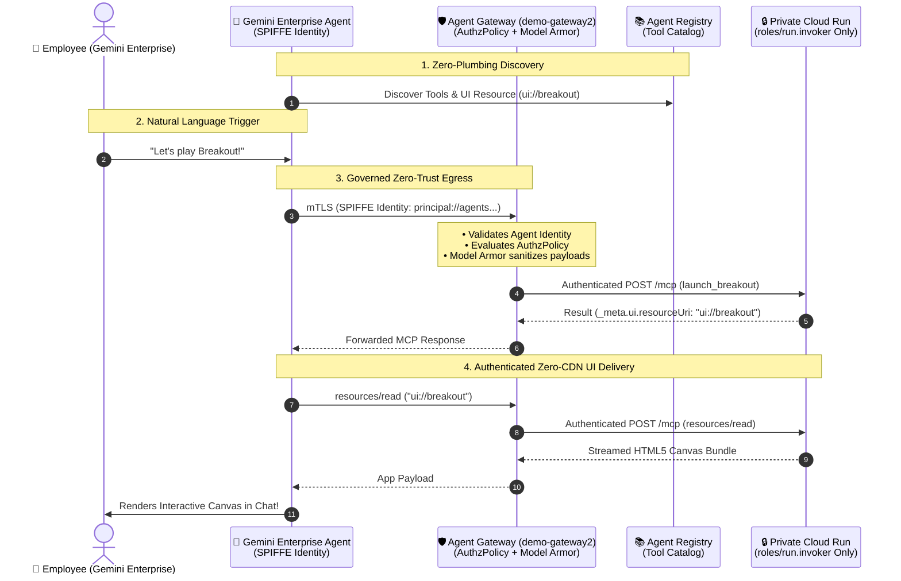

# 🕹️ Retro Breakout — Secure Enterprise MCP App for Gemini Enterprise

An interactive Atari-style Breakout arcade game built as a **Model Context Protocol (MCP) App** (UI Extension) designed to showcase secure, governed application execution inside the **Gemini Enterprise Agent Platform (GEAP)**.

When a user in Gemini Enterprise asks:
> *"Let's play a game"* or *"Launch Breakout"*

Gemini executes the MCP server's `launch_breakout` tool. The response returns an interactive UI resource URI (`ui://breakout`), prompting Gemini Enterprise to stream the self-contained HTML5 canvas game directly into the chat conversation. Users can play in real-time while the agent live-adjusts physics or activates cheat codes (**Twin Laser Cannons**, **Mega Paddle**, **God Mode**).

---

## 🏛️ Why GEAP? The 4 Pillars of Governed MCP Apps



### 1. Centralized Catalog via Agent Registry
Eliminates brittle webhooks and connector sprawl. Services publish schemas, interfaces, and `_meta.ui` tags centrally so agents discover tools dynamically.

### 2. Zero-Trust Ingress & Private Workloads
Backend Cloud Run services run private (`--no-allow-unauthenticated`). Ingress is restricted to verified Google Cloud OIDC tokens from authorized Service Agents (`gcp-sa-discoveryengine`, `gcp-sa-agentgateway`).

### 3. Deep Egress Governance & Model Armor
Outbound tool calls route through **Agent Gateway**:
- **Identity Gate (`REQUEST_AUTHZ`):** Enforces cryptographic SPIFFE identities (`principal://agents.global...`) over mTLS with fine-grained tool authorization policies.
- **Payload Inspection (`CONTENT_AUTHZ`):** Model Armor inspects and sanitizes tool arguments in flight, defending against prompt injections and malicious parameter tampering.

### 4. Zero-CDN Secure UI Delivery
The entire HTML5/JS canvas bundle is delivered directly through the authenticated MCP channel (`resources/read`), running inside a sandboxed iframe with dynamic `postMessage` origin locking — eliminating external CDN dependencies, XSS vectors, and asset tampering.

---

## 🎮 Features & MCP Tools

| Tool / Capability | Description | Input Parameters |
| :--- | :--- | :--- |
| **`launch_breakout`** | Initializes the Breakout UI iframe inside the chat thread. | *(none)* |
| **`update_game_settings`** | Live-adjusts game physics and gameplay rules. | `paddleSize` (40–350px), `ballSpeed` (1–15), `lives` (1–20), `autopilot` (bool), `godMode` (bool) |
| **`trigger_game_cheat`** | Activates arcade cheat codes in real time. | `cheat`: `"laser_paddle"` (Twin Blasters), `"mega_paddle"` (220px), `"god_mode"`, `"extra_ball"`, `"slow_ball"`, `"win_level"` |
| **`ui://breakout`** *(Resource)* | Self-contained HTML5 canvas game with particle physics and session persistence. | *(text/html;profile=mcp-app)* |

---

## 🔐 Standards-Compliant Cloud-Agnostic OAuth 2.0

Includes a built-in, zero-dependency OAuth 2.0 authorization server (RFC 6749 & RFC 7636):
- **Authorization Code Flow with PKCE (`S256` & `plain`)**: Compatible with Gemini Enterprise, Discovery Engine, Claude Desktop, Cursor, and enterprise MCP proxies.
- **Client Credentials & Token Rotation**: Supports direct server-to-server integrations with automatic cryptographic token rotation.
- **Cloud-Agnostic Portability**: Built entirely with native Node.js `crypto` primitives — portable to Google Cloud Run, AWS App Runner, Azure Container Apps, or Kubernetes without vendor lock-in.

---

## 🚀 Deployment & Enterprise Setup

* **Full Step-by-Step Enterprise Guide:** See [docs/GEAP_ENTERPRISE_SETUP.md](docs/GEAP_ENTERPRISE_SETUP.md) for complete end-to-end instructions covering Agent Registry, Agent Gateway (`demo-gateway2`), AuthzPolicy, Model Armor, custom IAM roles, and Discovery Engine Data Store wiring.

### Quick Start (Google Cloud Run)
```bash
# 1. Deploy private Cloud Run service
gcloud run deploy mcp-breakout-arcade \
  --source . \
  --region us-central1 \
  --project <PROJECT_ID> \
  --no-allow-unauthenticated

# 2. Grant Invoker role to Discovery Engine & Agent Gateway Service Agents
gcloud run services add-iam-policy-binding mcp-breakout-arcade \
  --member="serviceAccount:service-<PROJECT_NUMBER>@gcp-sa-discoveryengine.iam.gserviceaccount.com" \
  --role="roles/run.invoker" \
  --region=us-central1 \
  --project=<PROJECT_ID>

gcloud run services add-iam-policy-binding mcp-breakout-arcade \
  --member="serviceAccount:service-<PROJECT_NUMBER>@gcp-sa-agentgateway.iam.gserviceaccount.com" \
  --role="roles/run.invoker" \
  --region=us-central1 \
  --project=<PROJECT_ID>

# 3. Connect in Gemini Enterprise Console (OAuth 2.0 PKCE S256)
# MCP URL:       https://<CLOUD_RUN_URL>/mcp
# Authorize URL: https://<CLOUD_RUN_URL>/authorize
# Token URL:     https://<CLOUD_RUN_URL>/token
```

---

## 💻 Local Development

```bash
# Install and run
npm install
npm run dev

# Endpoints:
# • MCP SSE:          http://localhost:8080/mcp
# • MCP JSON-RPC:     http://localhost:8080/mcp (POST)
# • OAuth 2.0 PKCE:   http://localhost:8080/authorize & /token
# • Direct Preview:   http://localhost:8080/game
```

---

## 📄 License
Apache 2.0
