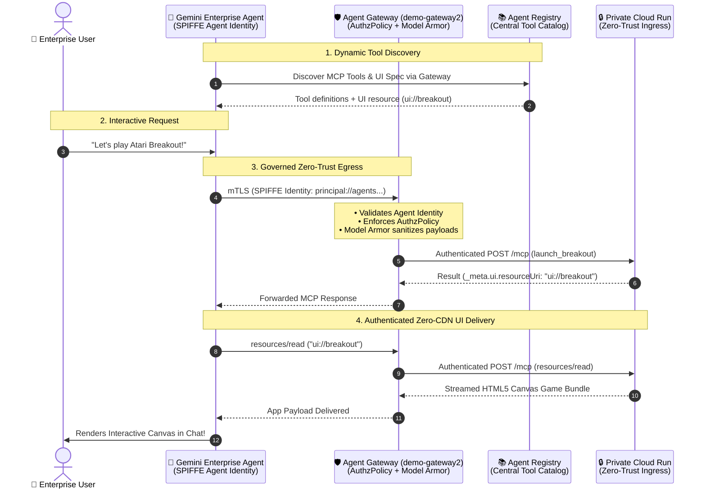

# 🛡️ Gemini Enterprise Agent Platform (GEAP) — Enterprise Setup Guide

This guide provides step-by-step instructions for deploying, securing, registering, and connecting the **Retro Breakout MCP App** within the **Gemini Enterprise Agent Platform (GEAP)** ecosystem on Google Cloud.

---

## 🧭 Why GEAP? Architecture & Differentiation

In traditional AI tool architectures, agents invoke external APIs via hardcoded URLs, static API keys, and uninspected webhooks. This introduces severe enterprise risks:
* **Tool Sprawl & Blind Egress:** No centralized visibility into which tools agents can access.
* **Credential Leaks:** Static API keys and secrets hardcoded into agent configurations.
* **Prompt Injection & Parameter Tampering:** Malicious user inputs directly triggering uninspected backend executions.
* **CDN & XSS Vulnerabilities:** Web UIs loaded from external CDNs that can be hijacked or blocked by strict enterprise Content Security Policies (CSP).



### The 4 Pillars of GEAP Governance

1. **Central Tool Catalog (Agent Registry):** Single pane of glass for all enterprise MCP servers, OpenAPI tools, and UI extensions.
2. **Cryptographic Zero-Trust Ingress (Private Cloud Run):** Workloads are completely private (`--no-allow-unauthenticated`), strictly accepting Google OIDC tokens from authorized Service Agents.
3. **Egress Governance & Inspection (Agent Gateway + Model Armor):** Evaluates SPIFFE agent identities over mTLS and sanitizes payloads in-flight before tools execute.
4. **Zero-CDN Secure UI Delivery (MCP Apps Protocol):** Delivers full interactive HTML5/JS applications directly through the authenticated MCP channel (`resources/read`), running inside sandboxed iframes with origin-locked postMessage bridges.

---

## 📋 Prerequisites & Environment Setup

Ensure you have the required Google Cloud SDK components, project access, and environment variables defined:

```bash
export PROJECT_ID="<YOUR_PROJECT_ID>"
export REGION="us-central1"
export SERVICE_NAME="mcp-breakout-arcade"
export GATEWAY_NAME="demo-gateway2"
export SERVICE_ID="retro-breakout-service"

# Retrieve project number
export PROJECT_NUMBER=$(gcloud projects describe $PROJECT_ID --format='value(projectNumber)')
```

### Enable Required Google Cloud APIs
```bash
gcloud services enable \
  run.googleapis.com \
  discoveryengine.googleapis.com \
  agentregistry.googleapis.com \
  networkservices.googleapis.com \
  iam.googleapis.com \
  --project=$PROJECT_ID
```

---

## 🛠️ Step 1: Deploy Private Cloud Run Workload

Deploy the MCP server with public internet access disabled (`--no-allow-unauthenticated`):

```bash
gcloud run deploy $SERVICE_NAME \
  --source . \
  --platform managed \
  --region $REGION \
  --project $PROJECT_ID \
  --no-allow-unauthenticated \
  --port 8080
```

Capture the deployed service URL:
```bash
export CLOUD_RUN_URL=$(gcloud run services describe $SERVICE_NAME \
  --platform managed \
  --region $REGION \
  --project $PROJECT_ID \
  --format='value(status.url)')
echo "Private Cloud Run URL: $CLOUD_RUN_URL"
```

---

## 🔐 Step 2: Configure Service Agent IAM Roles

Grant `roles/run.invoker` strictly to the Google Cloud Service Agents that facilitate Discovery Engine and Agent Gateway routing:

```bash
# 1. Discovery Engine Service Agent
gcloud run services add-iam-policy-binding $SERVICE_NAME \
  --member="serviceAccount:service-${PROJECT_NUMBER}@gcp-sa-discoveryengine.iam.gserviceaccount.com" \
  --role="roles/run.invoker" \
  --region=$REGION \
  --project=$PROJECT_ID

# 2. Agent Gateway Service Agent
gcloud run services add-iam-policy-binding $SERVICE_NAME \
  --member="serviceAccount:service-${PROJECT_NUMBER}@gcp-sa-agentgateway.iam.gserviceaccount.com" \
  --role="roles/run.invoker" \
  --region=$REGION \
  --project=$PROJECT_ID

# 3. Service Extensions Data Plane Agent (if cross-project DEP is used)
gcloud run services add-iam-policy-binding $SERVICE_NAME \
  --member="serviceAccount:service-${PROJECT_NUMBER}@gcp-sa-dep.iam.gserviceaccount.com" \
  --role="roles/run.invoker" \
  --region=$REGION \
  --project=$PROJECT_ID
```

---

## 📚 Step 3: Grant Agent Registry & Gateway Permissions

Create a custom IAM role to allow Discovery Engine to browse the Agent Registry catalog and route through the Agent Gateway:

```bash
gcloud iam roles create geAgentRegistryViewer \
  --project=$PROJECT_ID \
  --title="Gemini Enterprise Agent Registry Viewer" \
  --description="Allows Discovery Engine to discover services in Agent Registry and use Agent Gateways" \
  --permissions="agentregistry.agents.list,agentregistry.agents.get,agentregistry.agents.search,agentregistry.mcpServers.list,agentregistry.mcpServers.get,agentregistry.mcpServers.search,networkservices.agentGateways.list,networkservices.agentGateways.get,networkservices.agentGateways.use"

gcloud projects add-iam-policy-binding $PROJECT_ID \
  --member="serviceAccount:service-${PROJECT_NUMBER}@gcp-sa-discoveryengine.iam.gserviceaccount.com" \
  --role="projects/${PROJECT_ID}/roles/geAgentRegistryViewer"
```

---

## 📑 Step 4: Register Service in Agent Registry

Register the MCP service interface and tool specification into the Google Cloud Agent Registry:

```bash
SPEC_CONTENT=$(cat toolspec.json)

gcloud agent-registry services create $SERVICE_ID \
  --project=$PROJECT_ID \
  --location=$REGION \
  --display-name="Retro Breakout Arcade MCP App" \
  --description="Interactive Atari Breakout arcade game with real-time physics controls and UI extension" \
  --interfaces="[{\"protocolBinding\": \"JSONRPC\", \"url\": \"${CLOUD_RUN_URL}/mcp\"}]" \
  --mcp-server-spec-type=tool-spec \
  --mcp-server-spec-content="$SPEC_CONTENT"
```

*(Note: If updating an existing service, use `gcloud agent-registry services update` instead).*

---

## 🛡️ Step 5: Configure Agent Gateway (`demo-gateway2`)

Agent Gateway governs all tool invocations made by Gemini Enterprise:

### 1. Verify / Create the Agent Gateway
```bash
gcloud network-services agent-gateways describe $GATEWAY_NAME \
  --location=$REGION \
  --project=$PROJECT_ID 2>/dev/null || \
gcloud network-services agent-gateways create $GATEWAY_NAME \
  --location=$REGION \
  --project=$PROJECT_ID
```

### 2. Configure Authorization Policy (`AuthzPolicy`)
Ensure the Gateway allows incoming requests originating from the Gemini Enterprise Agent SPIFFE identity:
* **Principal:** `principal://agents.global.discoveryengine.googleapis.com/...`
* **Action:** `ALLOW`
* **Protocol:** `tools/call`, `tools/list`, `resources/read`, `resources/list`

### 3. Attach Model Armor Inspection Template
Enable payload sanitization on the Gateway to inspect and validate all tool parameters before forwarding to Cloud Run.

---

## 🖥️ Step 6: Connect in Gemini Enterprise Console

1. Open **Google Cloud Console** &rarr; **Agent Builder (Discovery Engine)** &rarr; **Data Stores**.
2. Click **Create Data Store**.
3. Select **Agent Gateway / Agent Registry** (or **Custom MCP Server**):
   - **Data Store Name:** `mcp-breakout-arcade`
   - **MCP Server URL:** `${CLOUD_RUN_URL}/mcp`
   - **Authorization Endpoint:** `${CLOUD_RUN_URL}/authorize`
   - **Token Endpoint:** `${CLOUD_RUN_URL}/token`
   - **Authentication Type:** `OAuth 2.0 (PKCE)` with `S256`
   - **Client ID:** `gemini-enterprise-agent`
4. Click **Create & Connect**.
5. Navigate to your **Gemini Enterprise Agent** &rarr; **Actions** tab:
   - Click **Add Action** and attach the `mcp-breakout-arcade` data store.
   - Click **Reload custom actions** to verify all 7 tools (`launch_breakout`, `update_game_settings`, `trigger_game_cheat`, etc.) are recognized.
6. Publish / Save the Agent configuration.

---

## 🎮 Step 7: Test & Verify the Interactive Experience

1. Open the **Gemini Enterprise Chat** interface.
2. Type:
   > *"Let's play a game"* or *"Launch Breakout"*
3. **Observe the Handshake:**
   - Gemini Enterprise calls `launch_breakout`.
   - The tool returns `{ _meta: { ui: { resourceUri: "ui://breakout" } } }`.
   - Gemini Enterprise fetches `resources/read: ui://breakout` over the Agent Gateway.
   - The sandboxed iframe mounts, performs the 3-way `postMessage` handshake, and renders the retro arcade game directly inside the conversation thread.
4. **Test Live Gameplay Control via Chat:**
   - *"Equip laser cannons"* &rarr; Agent invokes `trigger_game_cheat(cheat="laser_paddle")`. Twin laser turrets appear on the paddle.
   - *"Make the paddle wider and slow down the ball"* &rarr; Agent invokes `update_game_settings(paddleSize=220, ballSpeed=3.5)`.

---

## 🔍 Troubleshooting & Observability

### Inspect Invocations via Cloud Logging
```bash
# Cloud Run Execution Logs
gcloud logging read "resource.type=cloud_run_revision AND resource.labels.service_name=${SERVICE_NAME}" \
  --limit=20 \
  --format="table(timestamp, textPayload)" \
  --project=$PROJECT_ID

# Agent Gateway Ingress & Audit Logs
gcloud logging read "resource.type=network_services_gateway AND log_name:agent_gateway" \
  --limit=20 \
  --project=$PROJECT_ID
```

### Common Issues & Solutions
| Issue | Root Cause | Resolution |
| :--- | :--- | :--- |
| **`403 Forbidden` on `/mcp`** | Missing `roles/run.invoker` on Cloud Run. | Run Step 2 to re-bind Discovery Engine & Agent Gateway Service Accounts. |
| **`401 Unauthorized` on OAuth** | PKCE verifier mismatch or expired authorization code. | Ensure `PKCE S256` is enabled in Data Store configuration. Codes expire in 5 minutes. |
| **Tool listed but UI doesn't render** | Missing `_meta.ui.resourceUri` in tool spec. | Re-sync `toolspec.json` in Agent Registry (Step 4). |
| **Iframe postMessage Warning** | Origin spoofing or unverified parent domain. | Ensure parent origin matches your enterprise domain. The bridge locks origin on first handshake. |

---

## 📄 References & Related Documentation
* [Model Context Protocol (MCP) Specification](https://modelcontextprotocol.io/)
* [MCP Apps Specification (Ext-Apps)](https://github.com/modelcontextprotocol/ext-apps)
* [Google Cloud Agent Registry Documentation](https://cloud.google.com/gemini/docs/enterprise)
* [Google Cloud Agent Gateway Documentation](https://cloud.google.com/network-services/docs)
